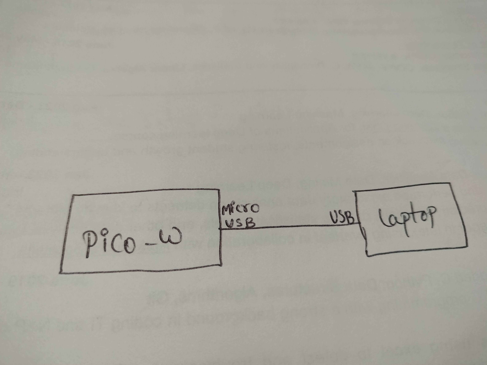

# About
This project will blink the Pico-W on-board led for every 200 msec. 

## Installation of prerequisites and build process

**Step1:-** If you are working on windows system then open the WSL terminal and follow the below steps.

**Step2:-** Following commands will install gcc-arm-none-eabi.
    ```bash
    sudo apt update
    sudo apt install cmake gcc-arm-none-eabi libnewlib-arm-none-eabi build-essential git
    ```
  
**Step3:-** It will clone the pico sdk.
    ```bash
    git clone https://github.com/raspberrypi/pico-sdk.git --branch master
    cd pico-sdk
    git submodule update --init
    ```

**Step4:-** Navigate to `cyw43-driver` and checkout the following command. It will update cyw43-driver, lwip, tinyusb to enable network and usb related functionalities.
    ```bash
    cd lib/cyw43-driver
    git submodule update --init
    ```

**Step5:-** checkout `led_blink_pico_w` by entering the following commands
    ```bash
    git clone https://github.com/RajkumarGara/led_blink_pico_w
    cd led_blink_pico_w
    mkdir build
    cd build
    ```

**Step6:-** Set the PICO_SDK_PATH Environment Variable with following command. Enter your pico sdk path in place of path_to_pico-sdk in the below command.
    ```bash
    export PICO_SDK_PATH=path_to_pico-sdk
    ```

**Step7:-** In the below command update your wifi ssid and password and build the project.
    ```bash
    cmake -DPICO_BOARD=pico_w -DWIFI_SSID="your wifi ssid" -DWIFI_PASSWORD="your wifi password" ..
    ```

**Step8:-** compile the project by entering make command.
    ```bash
    make
    ```


## Project Images
Connect Pico-W to laptop through usb.



